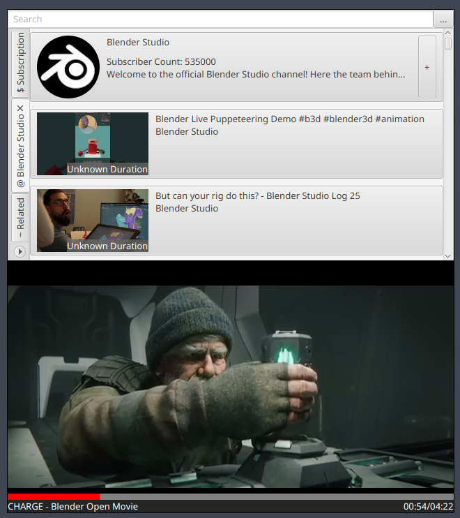

# PiPTube
  
PiPTube is a picture-in-picture streaming client with integrated controls.

#### Screenshots

### Features:
- Choose stream and manage client without exiting picture-in-picture mode;
- Hide or unhide controls by scrolling or middle-clicking on the player;
- Subscribe to channels and view subscription feed;

### Setup
1. Navigate to the `Artifacts` tab under the `Build` tab in the side menu.
2. Press the download button besides the latest successful `build` job.
3. Extract the archive to obatin the `.jar` file for the correct operating system.
4. If Java is not installed or is out-of-date,
   install JRE from [Eclipse Temurin](https://github.com/adoptium/temurin24-binaries/releases).
   Make sure the downloaded file is an executable or an archive containing the executable,
   run the executable to install.
5. Double click on the `.jar` file or run `java -jar <jar name>`,
   replacing `<jar name>` with the name of the `.jar` file.
